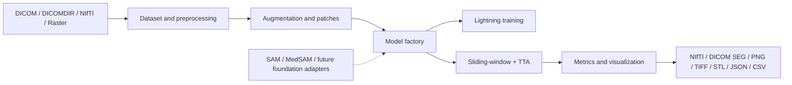
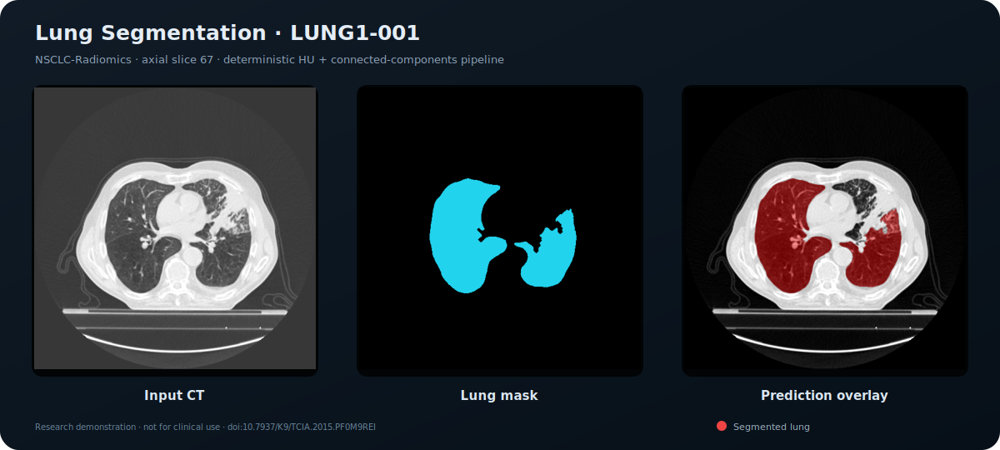

# medical-image-segmentation

[](https://python.org)
[](https://pytorch.org)
[](LICENSE)

## Overview

Production-oriented, model-agnostic medical-image segmentation for reproducible
2D/3D research. It combines PyTorch Lightning orchestration, MONAI networks and
inference, physical-space IO, surface metrics, portable exports, and explicit
extension points for foundation and interactive models.

> Research software only. It is not a certified medical device and must not be
> used as the sole basis for clinical decisions.

## Architecture



## Supported Models

UNet, UNet++, Attention UNet, VNet, SegResNet, DynUNet, and Swin UNETR are
constructed through the MONAI-backed factory. SAM and MedSAM intentionally use
checkpoint-specific adapters because their prompts and preprocessing are not
interchangeable with conventional semantic segmentation.

## Project Structure

`src/medical_image_segmentation` contains datasets, preprocessing, models,
losses, metrics, training, inference, visualization, explainability, exports,
configuration, and utilities. Checkout entrypoints are `src/train.py`,
`src/predict.py`, `src/inference.py`, and `src/evaluate.py`.

## Installation

```bash
python -m venv .venv
# Windows: .venv\Scripts\activate
python -m pip install --upgrade pip
pip install -e ".[tracking,sam,mesh,dev,docs]"
```

## Training

Create a CSV manifest with `image`, `mask`, and optional `id`. Use
`ExperimentConfig`, `SegmentationDataset`, `ModelFactory`, `SegmentationTask`,
and `create_trainer`. Lightning provides AMP, checkpoints, resume via `ckpt_path`,
early stopping, learning-rate scheduling, and TensorBoard logging. MLflow and
Weights & Biases are optional tracking extras.

## Inference

`InferenceEngine.predict()` supports full-image or MONAI sliding-window
inference, overlap control, probability maps, multiclass output, and flip-based
test-time augmentation.

## Evaluation

```bash
mis-evaluate prediction.npy target.npy --output outputs/metrics.json
```

## Datasets

DICOM, DICOMDIR, NIfTI, PNG, TIFF, and JPEG are supported by SimpleITK/MONAI
pipelines. Manifests keep cohort splits explicit. Always split by patient before
augmentation to prevent leakage.

## Metrics

Dice, IoU, precision, recall/sensitivity, specificity, confusion counts,
Hausdorff distance, ASSD, and volumetric similarity. Surface distances accept
physical voxel spacing.

## Examples

See `docs/usage.md`, docstrings, `scripts/example_config.yaml`, and unit tests.

## Screenshots



This self-contained SVG was generated by
`scripts/generate_overlay_example.py` from axial slice 67 of the public
[NSCLC-Radiomics `LUNG1-001` case](https://www.cancerimagingarchive.net/collection/nsclc-radiomics/).
It runs `segment_lungs_ct()` (HU thresholding, connected components, and
morphology) and renders the result with the package's `overlay()` function. No
untrained neural-network output is represented as a prediction. Dataset DOI:
[10.7937/K9/TCIA.2015.PF0M9REI](https://doi.org/10.7937/K9/TCIA.2015.PF0M9REI).

```bash
python scripts/generate_overlay_example.py ../datasets/data/LUNG1-001 assets/overlay-placeholder.svg
```

## Performance Benchmarks

No universal benchmark is claimed. Publish hardware, software versions, spatial
resolution, patch size, precision, dataset split, latency, memory, and confidence
intervals. A benchmark template is provided in the documentation.

## Citation

Use [`CITATION.cff`](CITATION.cff).

## License

[MIT](LICENSE)

## Contributing

See [`CONTRIBUTING.md`](CONTRIBUTING.md). Contributions require typed APIs,
docstrings, tests, reproducible settings, and de-identified fixtures.

## Future Work

Classification, radiomics, foundation models, self-supervision, federated
learning, vision transformers, interactive segmentation, MONAI Label,
Docker/Kubernetes, REST inference, cloud execution, and PACS/RIS integration.
